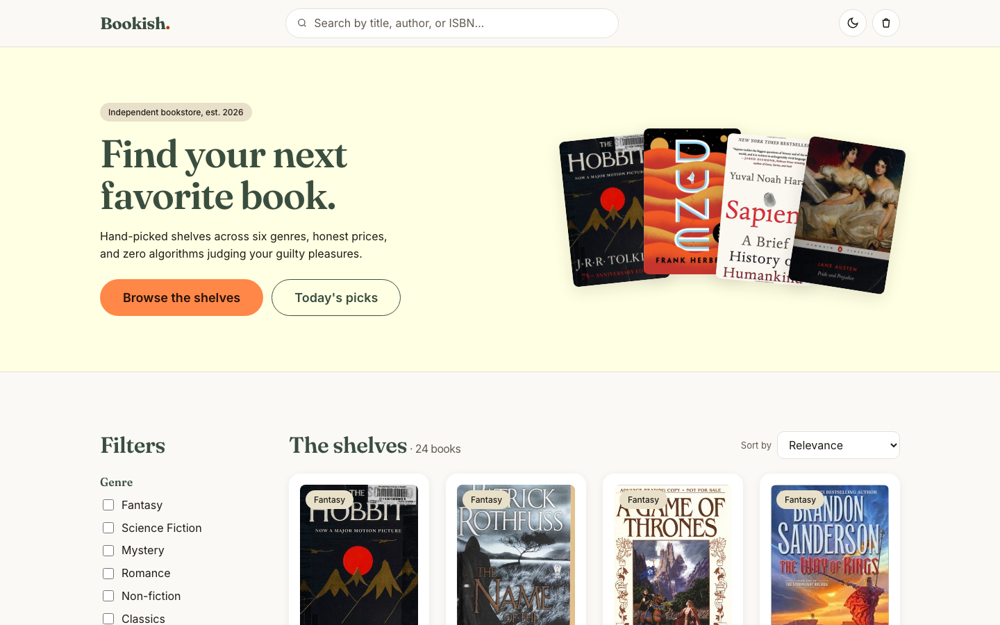
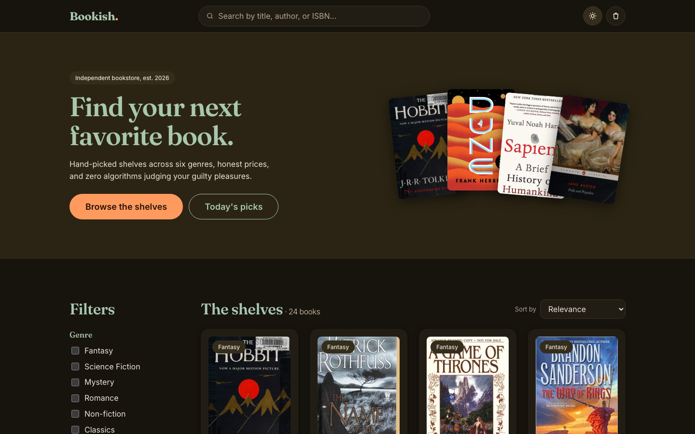

# Bookish - Online Book Store

A small e-commerce interface for books, built for the CISOGenie UI Developer assessment.
React + TypeScript on the front, Express + SQLite on the back, and it runs completely offline.

| Light | Dark |
| --- | --- |
|  |  |

## Features

- Book catalog of 24 seeded titles across 6 genres.
- Debounced search across title, author, and ISBN.
- Filters: genre, price range, minimum rating, in-stock only, with removable active-filter chips.
- Sorting: relevance, price (both directions), rating.
- Book details page with sticky cover, accordion sections, and a "More like this" row.
- Slide-over shopping cart with quantity stepper (typing allowed, clamps to stock), persisted to localStorage.
- Checkout summary with full form validation and a 5% mock tax. No payment gateway.
- Light and dark themes with a toggle. Every text/background pair passes WCAG AA (verified by script).
- API rate limiting, React error boundary, and per-request error states with retry.

## Requirements

- Node.js 22 or newer (the server uses the built-in `node:sqlite`, so there is no native compile step).
- pnpm 9+ (`corepack enable` or `npm i -g pnpm`).

## Getting started

```bash
pnpm install
pnpm dev
```

Then open http://localhost:5173.

That is the whole setup.
The Express API starts on port 3001, Vite proxies `/api` to it, and the SQLite database (`server/bookish.db`) is created and seeded automatically on first boot.
To reset the store, delete `server/bookish.db` and restart.

### Other commands

```bash
pnpm test            # 18 unit/integration tests (Vitest + Supertest)
pnpm build           # typecheck both packages and build the client
pnpm check:contrast  # WCAG AA audit of every theme token pair, light and dark
```

## Project structure

```
client/   Vite + React + TypeScript UI (Zustand cart, CSS modules)
server/   Express + node:sqlite API (search/filter/sort in SQL, orders, rate limit)
shared/   Types, validation rules, and cart math imported by BOTH sides
scripts/  check-contrast.mjs - parses theme.css and fails if any pair drops below AA
```

The validation module in `shared/` is the single source of truth:
the checkout form and the `POST /api/orders` endpoint run the exact same rules, so the client and server can never disagree about what a valid order is.

### API

| Route | Description |
| --- | --- |
| `GET /api/books` | Catalog. Query params: `search`, `genres`, `minPrice`, `maxPrice`, `minRating`, `inStock`, `sort`. All filtering happens in SQL with parameterized queries. |
| `GET /api/books/:id` | One book. |
| `GET /api/books/:id/related` | Up to 6 same-genre books. |
| `POST /api/orders` | Re-validates server-side, checks and decrements stock in a transaction, returns an order number and totals. |

## Design decisions and assumptions

- **Fully offline.** Fraunces and Inter are self-hosted woff2 files and all 24 cover images are committed to the repo, so nothing is fetched from the network at runtime.
- **`node:sqlite` over a driver package.** Zero dependencies, zero node-gyp failures on the reviewer's machine. This is why Node 22+ is required.
- **All design values are tokens.** `client/src/theme.css` is the single source of every color, radius, shadow, font size, and spacing value. Component CSS only references `var(--*)`. Dark mode is a second token set on `[data-theme="dark"]`.
- **Filter state lives in the URL.** Searches and filters are shareable and survive refresh and the back button.
- **Validation rules** (assumed for India): phone is exactly 10 digits, PIN code is exactly 6 digits. Fields validate on blur, then re-validate on every change once they have shown an error. Errors are wired with `aria-invalid` and `aria-describedby`.
- **Stock is enforced twice.** The UI clamps quantities to available stock, and the server rejects (409, transaction rolled back) any order that exceeds it.
- **Rate limiting** is a small fixed-window in-memory middleware (300 requests/min per IP), which is appropriate for a single-process local app.
- **Prices are in INR** with a flat mock 5% tax at checkout.
- Book metadata (titles, authors, ISBNs, covers) is real; ratings, prices, and stock are fabricated seed data.
- Cover images are fetched once at development time from Open Library and bundled. Two books are seeded out of stock on purpose to show that state.

## Accessibility

- Full keyboard support: the cart drawer and mobile filter sheet trap focus and close on Escape, and every interactive element has a visible `:focus-visible` outline.
- WCAG AA contrast in both themes, enforced by `pnpm check:contrast` (28 pairs, all held to 4.5:1).
- Semantic landmarks, labeled dialogs, `aria-live`-free forms with per-field error wiring, and `prefers-reduced-motion` support.
- Images use `loading="lazy"` inside fixed aspect-ratio boxes, so the layout never shifts.

## Responsive behavior

Mobile-first CSS with enhancements at 768px and 1024px:

- Below 768px: 2-column grid, full-width cart drawer, bottom-sheet filters, sticky add-to-cart bar on the details page, expandable header search.
- 768 to 1023px: 3-column grid, 420px cart drawer.
- 1024px and up: sticky sidebar filters and a 4-column grid.
